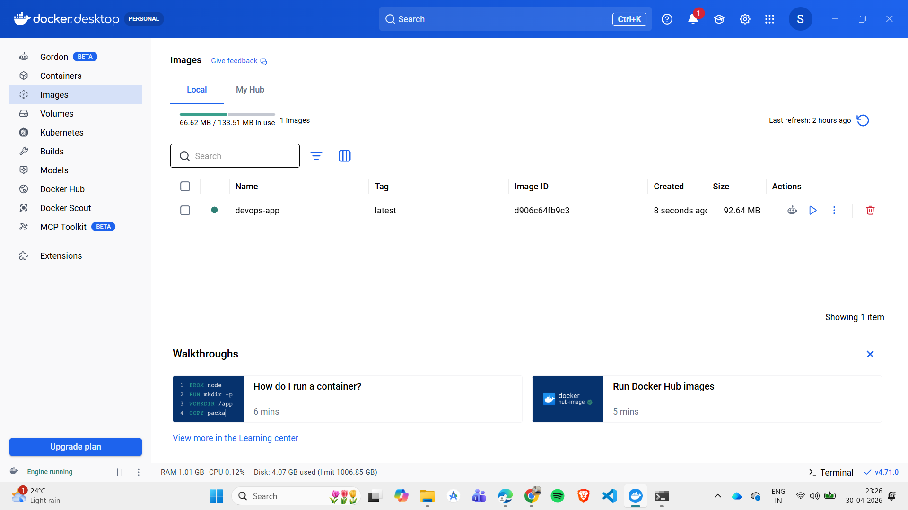
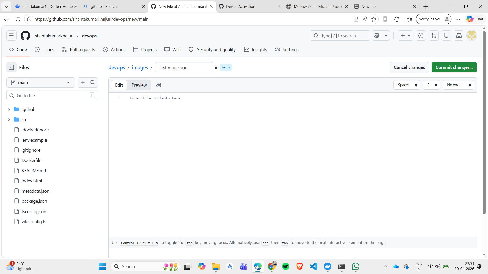

# Unit Converter using Flask

## Features
- Temperature Conversion
- Length Conversion
- Weight Conversion
- Currency Conversion

## Tech Stack
- Python Flask
- HTML/CSS
- Docker

## Run
python app.py

Open:
http://localhost:5000

## Screenshots

### Screenshot 1

### Screenshot 2

